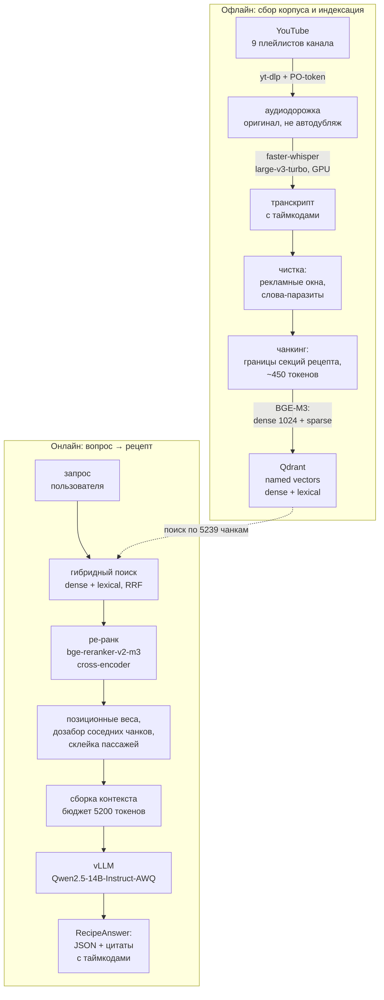
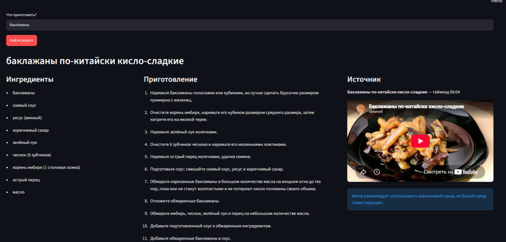

# oblomoff recipes RAG — рецепты с YouTube-канала «oblomoffood»

Спрашиваешь «как приготовить сочный стейк?» — получаешь структурированный
рецепт: блюдо, ингредиенты, пронумерованные шаги. **Только из того, что реально
сказано в видео**, со ссылкой на ролик и таймкод момента, откуда взят рецепт.

Корпус — 651 ролик канала, 5239 чанков. Весь стек локальный: распознавание речи,
эмбеддинги, ре-ранкер и LLM крутятся на одной RTX 5060 Ti, ни одного внешнего
API. У ответа есть измеримое качество: `hit@1 = 0.912`, `MRR = 0.956`,
ноль галлюцинаций на негативных запросах — см. раздел «Оценка качества».

## Архитектура



| Слой | Технология | Где |
|---|---|---|
| ETL | `yt-dlp` + `faster-whisper` (локальный ASR), чистка, вырезание рекламы | `src/etl/` |
| Чанкинг | предложения с таймкодами → блоки по секциям рецепта | `src/chunking/` |
| Эмбеддинги | `BAAI/bge-m3` — dense 1024 и sparse из одной модели | `src/index/embedder.py` |
| Векторная БД | Qdrant, named vector `dense` + sparse `lexical`, RRF-фьюжн | `src/index/store.py` |
| Retrieval | гибрид → cross-encoder ре-ранк → дедуп по видео → контекст под бюджет | `src/retrieval/` |
| Генерация | vLLM + `Qwen2.5-14B-Instruct-AWQ`, строгий JSON-выход | `src/generation/` |
| API / UI | FastAPI, опционально Streamlit | `src/api/`, `src/ui/` |
| Оценка | golden-набор из 42 запросов, метрики retrieval и генерации | `src/eval/` |

## Пример



Слева ингредиенты, по центру шаги, справа — ролик, открытый на нужной секунде,
и совет автора под ним. Тот же ответ через API:

```bash
curl -X POST localhost:8080/ask -H 'content-type: application/json' \
  -d '{"query":"баклажаны"}'
```

```json
{
  "query": "баклажаны",
  "found": true,
  "dish": "баклажаны по-китайски кисло-сладкие",
  "ingredients": ["баклажаны", "зелёный лук", "чеснок (6 зубчиков)", "…"],
  "steps": [
    "Нарежьте баклажаны полосками или кубиками, предпочтительно кубиками размером с мизинец.",
    "Очистите корень имбиря, нарежьте его на средний кубик, затем натрите на мелкой терке.",
    "…"
  ],
  "notes": "Автор рекомендует использовать коричневый сахар, но белый сахар также подходит.",
  "source": {
    "n": 1,
    "video_id": "Et1zq8pyg8I",
    "title": "Баклажаны по-китайски кисло-сладкие",
    "url": "https://youtu.be/Et1zq8pyg8I?t=4",
    "timecode": "00:04"
  },
  "model": "qwen2.5-14b",
  "used_reranker": true
}
```

Ключевое здесь — `source`: ответ не «сочинён по мотивам», а привязан к
конкретному ролику и секунде. Если в контексте рецепта нет, система возвращает
`found=false` вместо правдоподобной выдумки.

## Оценка качества

Без измерений RAG превращается в набор ощущений, поэтому в проекте есть
собственный golden-набор и харнесс.

`data/eval/golden.jsonl` — 42 размеченных запроса: 34 позитивных
(`exact` 16, `paraphrase` 12, `descriptive` 6 — ожидаем конкретные ролики) и
8 негативных (в корпусе такого рецепта нет, ожидаем честный `found=false`).
Разметка на уровне **видео**, а не чанка: рецепт растянут на весь ролик, и
требовать попадания в конкретный чанк бессмысленно.

```bash
python -m src.eval.run --mode retrieval               # быстро, без LLM
python -m src.eval.run --mode both --out data/eval/report.json
```

| Метрика | Что показывает |
|---|---|
| `hit@k`, `MRR` | нашёлся ли нужный ролик и на каком месте |
| `ctx_precision` | доля пассажей контекста из релевантных роликов — сколько бюджета токенов ушло на посторонние видео |
| `edge_rate` | доля пассажей, начатых крайним чанком (вступление/прощание): там гуще всего звучит название блюда, но рецепта нет |
| `found_acc` | совпал ли `found` с ожиданием — на негативных запросах ловит галлюцинации |
| `attribution` | указан ли валидный источник для найденного рецепта |
| `avg_steps`, `with_amounts` | детализация ответа и доля ингредиентов с граммовками |

Разбивка по `kind` показывает, где именно просаживается поиск: на точных
названиях, на пересказе или на запросах без имени блюда.

### Результаты (2026-09-02)

Конфигурация: `top_videos=2`, `per_video=6`, `token_budget=5200`,
`rerank_top=24`, эмбеддер и ре-ранкер на CPU.

| Retrieval (34 позитивных) | было | стало | | Генерация (все 42) | было | стало |
|---|---|---|---|---|---|---|
| MRR | 0.941 | **0.956** | | found_acc | 0.868 | **1.000** |
| hit@1 | 0.882 | **0.912** | | attribution | 0.931 | **1.000** |
| hit@3 / hit@5 | 1.000 | 1.000 | | avg_steps | 11.0 | 10.8 |
| ctx_precision | 0.827 | 0.830 | | avg_ingredients | 9.3 | 9.1 |
| edge_rate | 0.120 | **0.108** | | with_amounts | 0.147 | 0.155 |

По типам запроса hit@1: `exact` 0.88, `paraphrase` 1.00,
`descriptive` 0.67 → **0.83**.

Что дало прирост:

- **терпимый разбор `source_n`** — модель регулярно возвращает `[3, 4]` или
  `"[1]"` вместо `3`, схема падала, и полностью извлечённый рецепт выбрасывался
  с `found=false`. Снаружи это выглядело как «в расшифровках нет ответа» на
  запрос вроде «борщ», который система на самом деле знает;
- **заголовок ролика в эмбеддируемом тексте** — вытянул `descriptive`, самый
  слабый класс: без него название блюда «видит» только тот чанк, где автор его
  произнёс, то есть вступление;
- **инструкция в промпте про несколько роликов в контексте** — сняла ложные
  отказы, когда в контекст попадали два разных блюда;
- **порог релевантности перед генерацией** — мусорные запросы («стекло, гвозди,
  бумага») отсекаются до вызова LLM, экономя ~25 с на запрос.

Честные оговорки, а не только победные цифры:

- `found_acc` не детерминирована: при `temperature=0.2` запрос «рецепт счастья»
  в отдельных прогонах всё же получает ответ — система находит ролик про чили.
  Классы по скору ре-ранкера пересекаются, порогом это не лечится;
- набор мал: 34 позитивных запроса, один переехавший запрос двигает `hit@1`
  на 3 п.п.;
- `hit@3` уже упёрся в 1.000 и перестал различать варианты конфигурации.

### Ловушка воспроизводимости: fp16 меняет скоры

Ре-ранк 24 пар на CPU стоит ~31 с на запрос, поэтому итерации по ранжированию
удобнее гонять на GPU, погасив vLLM: **58 с на весь набор вместо 21 минуты**.

Ранжирующие метрики (`hit@k`, `MRR`) при этом совпадают до четвёртого знака, а
вот **скоры — нет**: `neg_score_max` 0.231 на CPU против 0.358 на GPU. Причина в
fp16: точность меняет логиты кросс-энкодера, а значит и сигмоиду на выходе.
Ранжирование этого не замечает, а любой **порог по абсолютному значению скора —
замечает**. Поэтому `RETRIEVAL_MIN_SCORE` калибруется только в прод-среде и на
той же конфигурации `retrieve()`, что в бою: у широкого прогона другой пул
кандидатов и, соответственно, другие скоры. Точность вынесена в
`RERANK_USE_FP16`, чтобы её можно было зафиксировать, а не наследовать от
устройства.

## Инженерные решения

### Retrieval: рецепт — это одно видео, а не пять чанков

Обычный RAG собирает контекст из топ-k чанков разных документов. Здесь это
ломается: рецепт целиком лежит в **одном** ролике и растянут на весь его
хронометраж. Отсюда конфигурация «мало видео, но глубоко» — `top_videos=2`,
`per_video=6`. При `3×2` в контекст попадали два вступления (название блюда там
звучит чаще всего), и LLM честно отвечала `found=false`, не увидев ни
ингредиентов, ни шагов.

Дальше — четыре приёма, каждый из которых вырос из конкретной поломки:

- **Позиционные веса.** Первый чанк ролика — это приветствие и перечисление
  («абхазский плов, туркменский плов…» — слово «плов» 25 раз и ноль рецепта):
  идеальный лексический матч и мусор в контексте. Штрафуем края ролика
  (`0.30` для первого чанка, `0.35` для последнего). Разметка секций для этого
  не годится: на ASR-корпусе она вырождена — 78% чанков помечены `steps`,
  `ingredients` — 0.9%, а первый чанк помечается `intro` лишь у пятой части
  видео. `chunk_index` врать не умеет.
- **Дозабор соседей.** Ранжирование выхватывает из рецепта отдельные точки, а
  сам рецепт непрерывен: шаг, начатый в чанке `i`, договаривается в `i+1`,
  который в топ не попал. Соседи добираются со `score=0` — они наполнитель, на
  ранг видео не влияют, но позволяют сшить разрывы.
- **Предел на размер пассажа.** Без него склейка из 6+ чанков давала один
  пассаж на 2000 слов, который обрезался с головы — то есть до вступления, где
  рецепта нет. Лучше несколько пассажей, которые дойдут целиком.
- **Отбор по релевантности, порядок — по времени.** Две разные задачи, которые
  раньше решались одной сортировкой по скору. Бюджет токенов должен уходить на
  самые релевантные пассажи, но в промпт они обязаны попасть в порядке
  приготовления — иначе LLM получала «накройте на ночь» раньше «сварите
  картошку» и восстанавливала порядок как умела.

Гибридный поиск здесь не для галочки: кулинарные запросы содержат и точные
термины («сулугуни», «су-вид»), которые ловит sparse-часть BGE-M3, и описания
без названия блюда («что приготовить из фарша на ужин»), где работает dense.

### ETL: почему локальный ASR, а не субтитры YouTube

Изначально транскрипты брались готовыми из YouTube. Это перестало работать:
эндпоинт субтитров `timedtext` жёстко лимитируется **по IP**, и после нескольких
сотен запросов отдаёт `IpBlocked` / `HTTP 429` на каждый вызов. Блок держится
сутки и снимается всего на ~20 запросов. Не помогают ни куки залогиненного
аккаунта, ни смена `player_client`, ни паузы между запросами.

При этом блокировка бьёт только по субтитрам — остальные слои живы:

| Слой | Состояние | Решение |
|---|---|---|
| `timedtext` (текст субтитров) | жёсткий per-IP 429 | обходим — не используем |
| InnerTube player API (плейлисты, метаданные) | challenge `The page needs to be reloaded` | PO-token (`pot-provider` в compose) |
| медиа-CDN `googlevideo` (аудио) | без ограничений | качаем аудио |

Поэтому основной путь — `--source asr`: скачиваем оригинальную аудиодорожку и
распознаём её локально на GPU (`large-v3-turbo`, ~90x realtime). Заодно вышло
точнее ютубовского автоASR — приходит готовая пунктуация и заглавные, так что
шаг восстановления пунктуации (`RUPunct`) на этом пути отключается сам.

```bash
docker compose up -d pot-provider                # без него не читаются плейлисты
python -m src.etl.pipeline --source asr --drop-non-recipe
```

Прогон резюмируемый: уже обработанные видео пропускаются, после обрыва
достаточно перезапустить ту же команду. Полный корпус (666 видео) — около 2.5 ч
на RTX 5060 Ti.

Подводный камень: у роликов канала есть **автодубляж на английский**, и в списке
форматов он идёт первым. Без явного фильтра по языку скачивается он, и Whisper
честно распознаёт английскую речь. Селектор дорожки задан в
`config.ASR_AUDIO_FORMAT` и предпочитает оригинал (`ba[language^=ru]`).

Путь через субтитры сохранён (`--source ytapi|ytdlp|auto`) — пригодится, если
собирать корпус с другого IP или через прокси
(`WEBSHARE_PROXY_USERNAME` / `_PASSWORD`).

### GPU-бюджет: 16 ГБ на всё

vLLM с 14B-AWQ занимает ~14.5 ГБ (веса 9.4 + KV-кэш 5). Поэтому `bge-m3` и
ре-ранкер в рантайме работают на **CPU** (`EMBED_DEVICE=cpu`,
`RERANK_DEVICE=cpu`), а массовое индексирование и прогоны оценки делаются
отдельно на GPU при остановленном vLLM. Это осознанный размен: ре-ранк на CPU
стоит секунд, но экономит перезагрузку 10 ГБ весов на каждый запрос.

## Запуск

Требуется NVIDIA GPU 16 ГБ + nvidia-container-toolkit.

```bash
cp .env.example .env

# 1. поднять БД и LLM
docker compose up -d qdrant vllm            # vLLM грузит ~10 ГБ весов, ~5 мин

# 2. индексация (один раз). Быстро — на GPU с хоста, погасив vLLM:
docker compose stop vllm
docker compose up -d pot-provider                    # PO-token для yt-dlp
python -m src.etl.pipeline --source asr --drop-non-recipe
python -m src.chunking.run --tokenizer BAAI/bge-m3
EMBED_DEVICE=cuda python -m src.index.build --recreate
docker compose start vllm
#   …либо целиком в контейнере на CPU (медленно):
#   docker compose --profile tools run --rm indexer

# 3. API
docker compose up -d api                    # http://localhost:8080/docs

# 4. (опц.) веб-интерфейс
docker compose --profile ui up -d ui        # http://localhost:8501
```

Проверка:

```bash
curl localhost:8080/health
```

### Эндпоинты

| Метод | Путь | Назначение |
|---|---|---|
| `GET` | `/health` | статус Qdrant и vLLM |
| `GET` | `/search?q=&k=&mode=` | сырой retrieval без LLM, быстрый |
| `POST` | `/ask` | `{query, top_videos?, per_video?, use_intent_filter?}` → `RecipeAnswer` |

### Без Docker

```bash
python -m venv .venv && .venv/Scripts/activate
pip install -r requirements.txt
pip install "torch>=2.7" --index-url https://download.pytorch.org/whl/cu128   # своя CUDA

docker compose up -d qdrant vllm
EMBED_DEVICE=cpu RERANK_DEVICE=cpu uvicorn src.api.main:app --port 8080
```

## Структура репозитория

```
src/etl/         Шаг 1    плейлисты → транскрипты с таймкодами → чистка
src/etl/asr.py            Шаг 1.5  аудиодорожка → faster-whisper (основной путь)
src/etl/punctuation.py    Шаг 1.5  RUPunct: пунктуация и регистр — для пути с субтитрами
src/chunking/    Шаг 2    транскрипт → чанки (предложения, секции, метаданные)
src/index/       Шаг 3    BGE-M3 → Qdrant (dense + sparse), идемпотентный upsert
src/retrieval/   Шаг 4    гибрид + ре-ранк + группировка + сборка контекста
src/generation/  Шаг 5    промпт → vLLM → RecipeAnswer (grounded, с цитатами)
src/api/         Шаг 6    FastAPI
src/ui/          Шаг 6    Streamlit (опц.)
src/eval/        Шаг 7    golden-набор → метрики retrieval и генерации
```

Каждый модуль запускается как самостоятельный CLI — удобно отлаживать слой в
отрыве от остальных:

```bash
python -m src.index.search "маринад для шашлыка" -k 5      # только векторный поиск
python -m src.retrieval.retrieve "борщ" --no-rerank        # retrieval без LLM
python -m src.generation.ask "как замариновать курицу" --json
python -m src.eval.run --mode retrieval
```

Мелочь про Windows: путь в `--out` задавайте **относительным**
(`--out data/eval/report.json`) — Git Bash разворачивает абсолютный `/app/...`
в путь Windows, и отчёт уезжает мимо контейнера.
